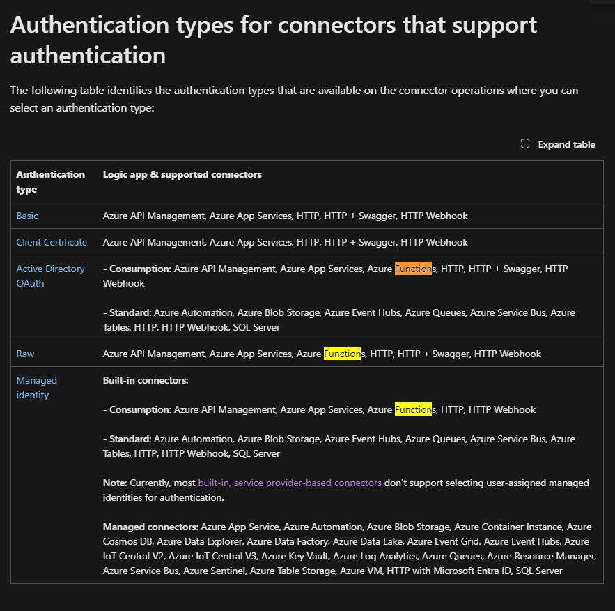
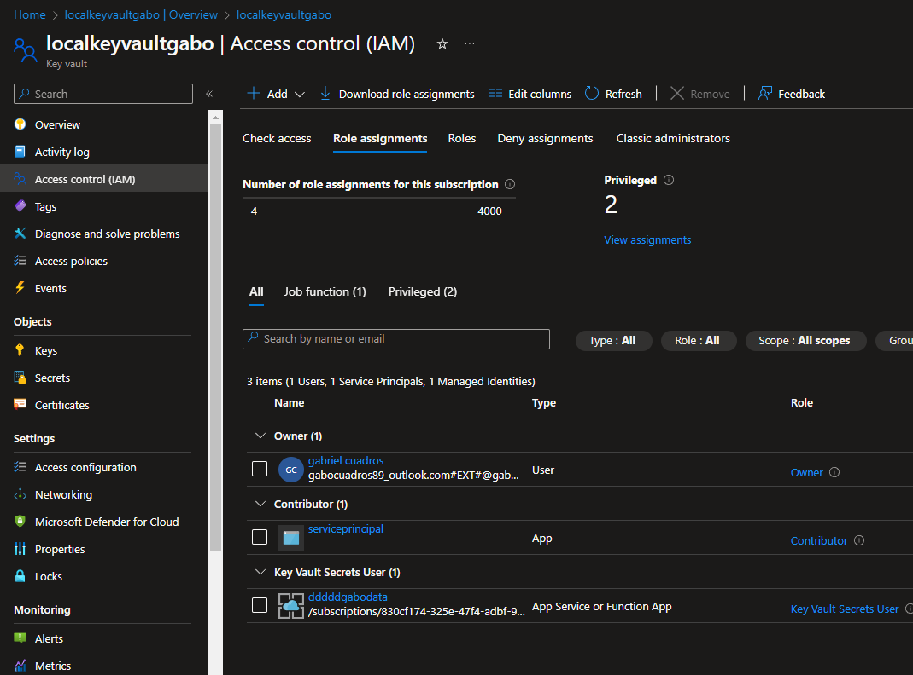
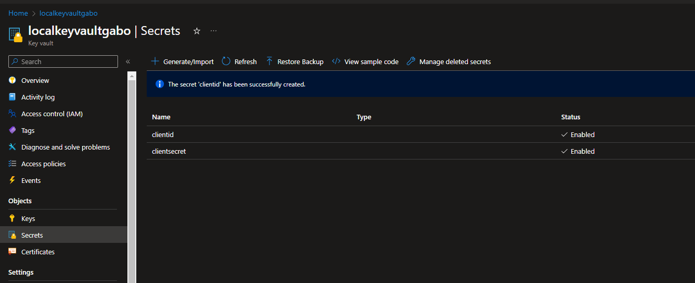
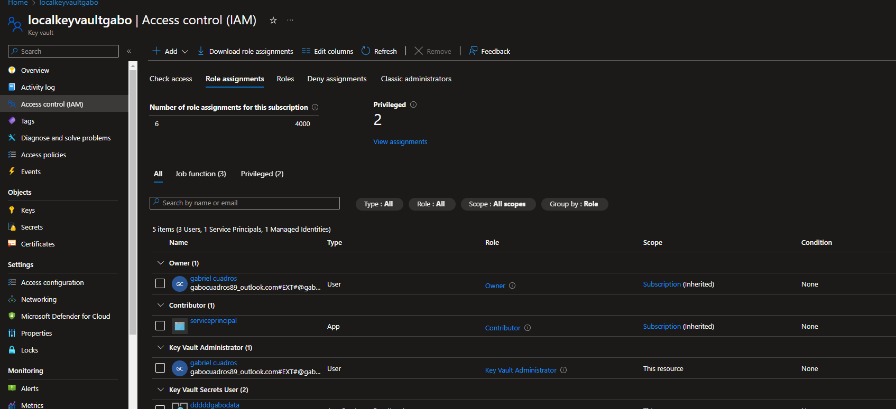

#demo

before start read this docs

https://learn.microsoft.com/en-us/azure/logic-apps/logic-apps-securing-a-logic-app?tabs=azure-portal#authentication-types-supported-triggers-actions

built int connector for function app from logic app doesnt support authentication so in our case we can do something like this

* request a token from entra id  endpoint
* create a task with a post request
* parse the response from entra id 
* put the acces_token in authorization bearer header in the post
* enable authentication in the azure function paired with a app reg/entrerprise app
* create a random role in the app reg
* assign the logic app managed identity into the enteprise app to tbe previous role 

https://learn.microsoft.com/en-us/entra/identity-platform/v2-oauth2-client-creds-grant-flow#get-a-token

* esnure that logic have key vault secret user in logic app´

add your secret in key vault 

dont forget to add yourself to the rbac so you can add them 

