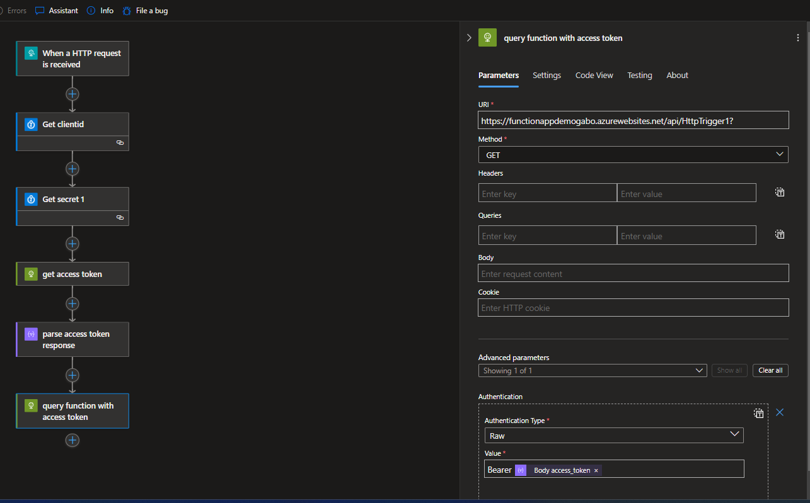

# definition of problem

before start read this docs

https://learn.microsoft.com/en-us/azure/logic-apps/logic-apps-securing-a-logic-app?tabs=azure-portal#authentication-types-supported-triggers-actions


built int connector for function app on logic app doesnt support authentication so in our case we can do something like this

# how to fix it 

* request a token from entra id  endpoint manually
* parse the json response from entra id 
* create a task with a post request to query the azure fucntion  put the acces_token in authorization bearer header

which inherit that credentials required to be obtained from key vault , this step is also explained below 

```
{
    "definition": {
        "$schema": "https://schema.management.azure.com/providers/Microsoft.Logic/schemas/2016-06-01/workflowdefinition.json#",
        "actions": {
            "Execute_query_1": {
                "inputs": {
                    "parameters": {
                        "query": "SELECT TOP (1000) * FROM [dbo].[BuildVersion]"
                    },
                    "serviceProviderConfiguration": {
                        "connectionName": "sql",
                        "operationId": "executeQuery",
                        "serviceProviderId": "/serviceProviders/sql"
                    }
                },
                "runAfter": {},
                "type": "ServiceProvider"
            },
            "Get_clientid": {
                "inputs": {
                    "parameters": {
                        "secretName": "clientid"
                    },
                    "serviceProviderConfiguration": {
                        "connectionName": "keyVault",
                        "operationId": "getSecret",
                        "serviceProviderId": "/serviceProviders/keyVault"
                    }
                },
                "runAfter": {
                    "Execute_query_1": [
                        "SUCCEEDED"
                    ]
                },
                "type": "ServiceProvider"
            },
            "Get_secret_1": {
                "inputs": {
                    "parameters": {
                        "secretName": "clientsecret"
                    },
                    "serviceProviderConfiguration": {
                        "connectionName": "keyVault",
                        "operationId": "getSecret",
                        "serviceProviderId": "/serviceProviders/keyVault"
                    }
                },
                "runAfter": {
                    "Get_clientid": [
                        "SUCCEEDED"
                    ]
                },
                "type": "ServiceProvider"
            },
            "get_access_token": {
                "inputs": {
                    "body": "\nclient_id=@{body('Get_clientid')?['value']}\n&resource=api://b1a17dfd-e3ca-40b6-96f6-f3cfca07f56a\n&client_secret=@{body('Get_secret_1')?['value']}\n&grant_type=client_credentials",
                    "headers": {
                        "Content-Type": "application/x-www-form-urlencoded"
                    },
                    "method": "POST",
                    "uri": "https://login.microsoftonline.com/18b08011-0a66-4da0-97f0-cc3e9571c9e9/oauth2/token"
                },
                "runAfter": {
                    "Get_secret_1": [
                        "SUCCEEDED"
                    ]
                },
                "runtimeConfiguration": {
                    "contentTransfer": {
                        "transferMode": "Chunked"
                    }
                },
                "type": "Http"
            },
            "parse_access_token_response": {
                "inputs": {
                    "content": "@body('get_access_token')",
                    "schema": {
                        "properties": {
                            "access_token": {
                                "type": "string"
                            },
                            "expires_in": {
                                "type": "string"
                            },
                            "expires_on": {
                                "type": "string"
                            },
                            "ext_expires_in": {
                                "type": "string"
                            },
                            "not_before": {
                                "type": "string"
                            },
                            "resource": {
                                "type": "string"
                            },
                            "token_type": {
                                "type": "string"
                            }
                        },
                        "type": "object"
                    }
                },
                "runAfter": {
                    "get_access_token": [
                        "SUCCEEDED"
                    ]
                },
                "type": "ParseJson"
            },
            "query_function_with_access_token": {
                "inputs": {
                    "authentication": {
                        "type": "Raw",
                        "value": "Bearer @{body('parse_access_token_response')?['access_token']}"
                    },
                    "method": "GET",
                    "uri": "https://functionappdemogabo.azurewebsites.net/api/HttpTrigger1?"
                },
                "runAfter": {
                    "parse_access_token_response": [
                        "SUCCEEDED"
                    ]
                },
                "runtimeConfiguration": {
                    "contentTransfer": {
                        "transferMode": "Chunked"
                    }
                },
                "type": "Http"
            }
        },
        "contentVersion": "1.0.0.0",
        "outputs": {},
        "triggers": {
            "When_a_HTTP_request_is_received": {
                "kind": "Http",
                "type": "Request"
            }
        }
    },
    "kind": "Stateful"
}
```


# image of each step 




# pre requisites

this idea also require to

* enable authentication in the azure function paired with a app reg/entrerprise app so the entra id auth is done when we try to enter to the azure fucntion, no custom configuration is done on here , by just enable work well


if we dont want to enable this, the other solution is to enable the authentication at the code level being deployed on the azure fucntion by using defaultazurecrednetials() impersonated with the resource identity, refer to this code block on (HttpTrigger1.cs) 

```
[Function("HttpTrigger1")]
public IActionResult Run([HttpTrigger(AuthorizationLevel.Anonymous, "get", "post")] HttpRequest req)
{
    _logger.LogInformation("C# HTTP trigger function processed a request.");
    return new OkObjectResult("Welcome to Azure Functions!");
}
```


* create a random role in the app reg refered line above


* assign the app registration as a user of himself  with the  previous role added


```
#IF THE APP REGISTRATION USED FOR AUTHENTICATION
oidForMI="0386f90a-0bf5-48f6-bb29-3118ad4c6b51"

appName="functionappdemogabo"
serverSPOID=$(az ad sp list --filter "displayName eq '$appName'" --query '[0].id' -o tsv | tr -d '[:space:]')

roleguid1="c96e85b4-0eeb-4e0b-9017-f6b7be2c920e"

az rest -m POST -u https://graph.microsoft.com/v1.0/servicePrincipals/$oidForMI/appRoleAssignments -b "{\"principalId\": \"$oidForMI\", \"resourceId\": \"$serverSPOID\",\"appRoleId\": \"$roleguid1\"}"
```


# the way to get a access token by post is shown on here (theoric info) this is used inside the logic app subtask

https://learn.microsoft.com/en-us/entra/identity-platform/v2-oauth2-client-creds-grant-flow#get-a-token


# they way to integrate keyvault with logic app is on here 

* ensure that logic have key vault secret user in logic app´


add your secret in key vault 


dont forget to add yourself to the rbac so you can add them 


